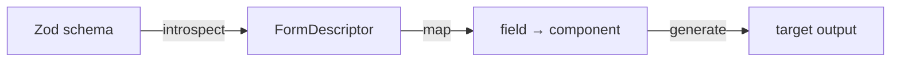

# kelex

Generate form artifacts from Zod schemas. A schema goes in; a structured description of its form comes out, ready for a code-generation target to turn into a component.

> **Status: pre-release, mid-rebuild.** The `composite` target — the form as a JSON `FormDescriptor` — is the only built-in output today. Framework code targets (Astro, Web Components) are in active development on a pluggable-transform architecture; the earlier React/TanStack target has been removed. Not yet published to npm; use it from a local build.

## What it does

kelex is a small, stateless pipeline: it reads a Zod schema and exits with files.



- **introspect** walks a live Zod schema into a `FormDescriptor`: every field's type, constraints, nesting, and order.
- **map** resolves each field to a component and props (the mapping layer a codegen target consumes).
- **generate** hands the descriptor to a target. The built-in `composite` target serializes it to JSON — the contract other tools (renderers, editors, a Rust reader) read without re-implementing Zod introspection.

## CLI

```sh
kelex generate <schema-path> -t composite -o form.json -s mySchema
kelex targets
```

| Option                | Description            | Default                  |
| --------------------- | ---------------------- | ------------------------ |
| `-o, --output <path>` | Output file path       | Derived from schema path |
| `-n, --name <name>`   | Form name              | Derived from schema name |
| `-s, --schema <name>` | Exported schema name   | `schema`                 |
| `-t, --target <name>` | Code-generation target | `composite`              |

The schema module is imported and evaluated at generate time (kelex reads the live Zod graph, not source text), so point it only at a schema path you trust.

## Programmatic API

```typescript
import { z } from "zod/v4";
import { generate, introspect, compositeTarget } from "@rafters/kelex";

export const userSchema = z.object({
  name: z.string().min(1),
  email: z.string().email(),
  role: z.enum(["admin", "user", "guest"]),
  address: z.object({ street: z.string(), city: z.string() }),
  tags: z.array(z.string()),
});

const result = generate({
  schema: userSchema,
  formName: "UserForm",
  schemaImportPath: "./schema",
  schemaExportName: "userSchema",
  target: compositeTarget,
});

result.files; // [{ filename, content }, ...]
result.fields; // ["name", "email", "role", ...]
result.warnings; // constructs the reader could not represent
```

`introspect`, `resolveField`, and `writeSchema` (FormDescriptor -> Zod source) are also exported. Register your own target with `registerTarget(target)` — a `CodegenTarget` takes the descriptor and returns output files, so a target can emit any format.

## Supported Zod constructs

Introspection handles: `string`, `number`, `boolean`, `date`, `enum`, `object` (nested), `array`, `tuple`, `record`, `union`, `discriminatedUnion`, plus `optional`, `nullable`, and `describe`. Constraints are carried onto the descriptor: `min`/`max` with gt-vs-gte inclusivity, `minLength`/`maxLength`, exact `.length()`, `regex`, string formats (`email`, `url`, `uuid`, ...), `startsWith`/`endsWith`, and default values. Field order is preserved.

Constructs the reader cannot represent — arbitrary refinements, and a few edge cases still being closed — are reported in `result.warnings` rather than dropped silently, so a consumer always knows what did not survive.

## Requirements

- **Zod 4** (`zod@^4.0.0`) — peer dependency; schemas are read from the live graph.
- **Node 24**.

## Development

- `pnpm` only. `pnpm build` (tsdown), `pnpm test` (vitest), `pnpm flightcheck` (lint + format + typecheck + all tests) before a PR.
- Lint/format: oxlint + oxfmt. TypeScript 7.
- Tests live in `test/` mirroring `src/`; `*.test.ts` unit, `*.spec.ts` integration.

## License

MIT
