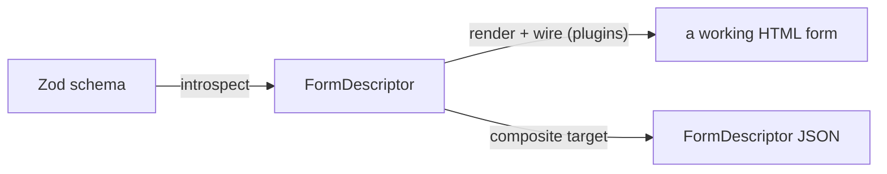

# kelex

Zod schema in, form out. A schema goes in; a working, accessible HTML form comes out — or a structured `FormDescriptor` for your own tools to render however they like.

> **Status: pre-release.** The plugin engine and the two default plugins (a base-HTML renderer and an async-POST handler) are built and tested; the `composite` target still emits the `FormDescriptor` as JSON. Framework code targets are next. Not yet published to npm — use it from a local build.

## What it does

kelex is a small, stateless pipeline: it reads a live Zod schema and produces form artifacts. Introspection is the shared front half; from the `FormDescriptor` you can go two ways.



- **introspect** walks a live Zod schema into a `FormDescriptor`: every field's type, constraints, nesting, and order.
- **render + wire** folds the descriptor through a _renderer_ plugin (schema → markup) and a _handler_ plugin (markup → behavior). The defaults give you a complete form with zero configuration.
- **composite target** serializes the descriptor to JSON — the contract other tools (renderers, editors, a Rust reader) read without re-implementing Zod introspection.

## Quick start

A schema, the two default plugins, and a working form:

```typescript
import { z } from "zod/v4";
import { introspect, renderForm, htmlRenderer, postHandler } from "@rafters/kelex";

const signupSchema = z.object({
  email: z.email(),
  displayName: z.string().min(2).max(40),
  plan: z.enum(["free", "pro", "team"]),
  acceptTerms: z.boolean(),
});

const descriptor = introspect(signupSchema, {
  formName: "SignupForm",
  schemaImportPath: "./schema",
  schemaExportName: "signupSchema",
});

// A complete, accessible, classless HTML form — validation attributes and all —
// wired for async POST. `renderForm` without a handler returns inert markup.
const html = renderForm(descriptor, htmlRenderer, postHandler);
```

The example stylesheet ships alongside; import or copy it:

```typescript
import "@rafters/kelex/form.css";
```

That is the whole out-of-the-box story: an `email` field becomes `<input type="email" required>`, a bounded number becomes a range slider, a nested object becomes a `<fieldset>`, an array becomes an add/remove repeater, a discriminated union becomes a variant switch — each control carrying `name`, a stable `id`, and a path-addressed error slot. On submit the handler validates natively in the browser, POSTs JSON, and routes the server's Standard-Schema issues back to the right fields.

## The plugin system

The engine is **consumer-agnostic**. It knows nothing about HTML, React, or your component kit — only how to fold a descriptor through two independent adapters:

```typescript
renderForm(descriptor, renderer, handler?) // = handler ? wire(render(...), ...) : render(...)
```

- A **`Renderer<T>`** turns a descriptor into output of some type `T` (an HTML string, a component tree, anything). It is data + code: an ordered **inventory** that matches a field's facts to a component, and **composers** — one per schema shape. There are exactly five shapes, in form-words, not CS terms:

  | shape       | schema topology                 |
  | ----------- | ------------------------------- |
  | `control`   | a scalar (string, number, …)    |
  | `group`     | an object or tuple              |
  | `list`      | an array or record (a `*` slot) |
  | `choice`    | a union                         |
  | `recursive` | a `z.lazy` recursion boundary   |

- A **`Handler<T>`** wires the rendered form — state, validation, submit — by control path. It has **no inventory**: it is uniform over controls, blind to which components a renderer chose.

The two never coordinate directly. They meet at one join: the descriptor's **canonical path**. The renderer stamps `name = path`; the handler routes validation issues back to controls by that same path (the exported `route` helper does it). `renderForm` runs a completeness check (the _floor_) up front and throws if a renderer can't answer some field type — so a field is never silently dropped.

Write your own plugin by implementing `Renderer<T>` / `Handler<T>` against the public contract — the same way the defaults do (they import nothing private). The convention is `@<org>/kelex-renderer-<kit>` and `@<org>/kelex-handler-<framework>`.

## Default plugins

Both ship in-package and import only the public contract, so they double as the reference implementation a kit author reads.

- **`htmlRenderer`** — zero-dependency, classless, semantic HTML. The schema does the work: constraints become native validation attributes (`required`, `minlength`, `pattern`, `min`/`max`/`step`, typed inputs), and each control emits the accessibility "hook trio" — `name` (the path), a sanitized unique `id`, `data-path` — plus `<label for>`, `aria-invalid`/`aria-describedby`, and an empty path-addressed error slot. Markup only; no behavior. Use `createHtmlRenderer({ action })` to set the form's POST target. Its ordered inventory demonstrates every match kind (format, meta-hint, constraint bucket) and is the canonical example for other kits.

- **`postHandler`** — framework-free async POST. On submit: native HTML5 validation gates the client (no Zod shipped to the browser), values are collected by `name` (typed — numbers as numbers, checkboxes as booleans) into nested JSON, and `fetch`-POSTed to the form's `action`. The server validates with the same Zod schema (Standard Schema) and returns issues, which the handler routes to each control's error slot by path. It also owns the interactivity the renderer left inert: union show/hide and array add/remove.

Client-side validation is intentionally native-only; full `~standard` validation runs on the **server** at POST.

## Conformance

Because kelex can't know a plugin's components, the only testable surface of the contract is the schema space. `conformance` runs a battery of generated schemas plus a seeded fuzzer and asserts the invariants a plugin must honor — the floor, totality (nothing hits the fallback), path-preservation, determinism, and the handler join:

```typescript
import { conformance, htmlRenderer, postHandler } from "@rafters/kelex";

const report = await conformance(htmlRenderer, postHandler, {
  names: (html) => [...html.matchAll(/name="([^"]+)"/g)].map((m) => m[1]),
});
report.passed; // true — the defaults are their own baseline
```

Run it against your renderer/handler to prove they hold the contract before you ship.

## The FormDescriptor (the other path)

If you'd rather own rendering entirely, take the descriptor as JSON. The `composite` target serializes it — the same contract editors and non-JS readers consume.

```typescript
import { z } from "zod/v4";
import { generate, compositeTarget } from "@rafters/kelex";

const result = generate({
  schema: userSchema,
  formName: "UserForm",
  schemaImportPath: "./schema",
  schemaExportName: "userSchema",
  target: compositeTarget,
});

result.files; // [{ filename, content }, ...]
result.warnings; // constructs the reader could not represent
```

`introspect`, `writeSchema` (a `FormDescriptor` back to Zod source), and `unwrapSchema` are exported too. Register your own target with `registerTarget(target)`.

### CLI

```sh
kelex generate <schema-path> -t composite -o form.json -s mySchema
kelex targets
```

| Option                | Description            | Default                  |
| --------------------- | ---------------------- | ------------------------ |
| `-o, --output <path>` | Output file path       | Derived from schema path |
| `-n, --name <name>`   | Form name              | Derived from schema name |
| `-s, --schema <name>` | Exported schema name   | `schema`                 |
| `-t, --target <name>` | Code-generation target | `composite`              |

The schema module is imported and evaluated at generate time (kelex reads the live Zod graph, not source text), so point it only at a schema path you trust.

## Docs

- [Getting started](./docs/getting-started.md) — install, the schema-to-form path, the server side, and the `FormDescriptor`/CLI path.
- [Writing plugins](./docs/writing-plugins.md) — the renderer/handler contract, the five shapes, the inventory and floor, and running `conformance`.

## Supported Zod constructs

Introspection handles `string`, `number`, `boolean`, `date`, `enum`, `literal`, `object` (nested), `array`, `tuple`, `record`, `union`, `discriminatedUnion`, and recursive schemas (`z.lazy`), plus `optional`, `nullable`, `default`, and `describe`/`meta`. Constraints are carried onto the descriptor: `min`/`max` with gt-vs-gte inclusivity, `minLength`/`maxLength`, exact `.length()`, `regex`, string formats (`email`, `url`, `uuid`, …), `startsWith`/`endsWith`. Field order is preserved.

Constructs the reader cannot represent — arbitrary refinements, and a few edge cases still being closed — are reported in `result.warnings` rather than dropped silently, so a consumer always knows what did not survive.

## Requirements

- **Zod 4** (`zod@^4.0.0`) — peer dependency; schemas are read from the live graph.
- **Node 24**.

## Development

- `pnpm` only. `pnpm build` (tsdown), `pnpm test` (vitest), `pnpm flightcheck` before a PR.
- Lint/format: oxlint + oxfmt. TypeScript 7.
- Tests live in `test/` mirroring `src/`; `*.test.ts` unit, `*.spec.ts` integration (require `pnpm build` first).

## License

MIT
