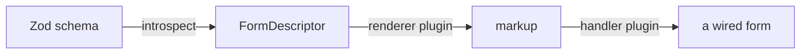

# kelex

Zod schema in, form out. kelex is a **plugin host**: a `kelex.settings.jsonc`
declares which plugins to load, and kelex reads your live Zod schema, loads the
plugins, and produces a form — the way ESLint or Vite read a config and load the
plugins named there.

> **Status: pre-release.** The host, the plugin contract, and the two default
> plugins (a base-HTML renderer and an async-POST handler) are built and tested.
> Not yet published to npm — build from a local checkout.

## What it does

kelex introspects a live Zod schema into a `FormDescriptor`, then folds it through
two plugin **surfaces** it loads from your settings: a **renderer** (schema →
output) and a **handler** (output → behavior).


```mermaid
flowchart LR
  A["Zod schema"] -- introspect --> B["FormDescriptor"]
  B -- "renderer plugin" --> C["markup"]
  C -- "handler plugin" --> D["a wired form"]
```

The renderer and handler never coordinate directly — they meet at one join, the
descriptor's canonical path (`name = path`). So you can swap either half, or write
your own.

## Monorepo

| package                           | what it is                                            |
| --------------------------------- | ----------------------------------------------------- |
| **`kelex`**                       | the host: introspection, engine, settings loader, CLI |
| **`@kelex/plugin-renderer-html`** | default renderer — classless, zero-dependency HTML    |
| **`@kelex/plugin-handler-post`**  | default handler — framework-free async POST           |

The core exposes explicit entry points (`kelex/engine`, `kelex/introspection`,
`kelex/conformance`, …) — no god barrel. Plugins depend only on the public
contract.

## Quick start

Install the host, the plugins you want, and Zod:

```sh
pnpm add kelex @kelex/plugin-renderer-html @kelex/plugin-handler-post zod
```

Declare them in `kelex.settings.jsonc`:

```jsonc
{
  "renderer": "@kelex/plugin-renderer-html",
  "handler": "@kelex/plugin-handler-post",
  "schema": "./src/schema.ts",
  "export": "signupSchema",
  "out": "signup.html",
  "renderer.options": { "action": "/api/signup" },
}
```

Run it:

```sh
kelex form
# ✓ Generated signup.html
#   renderer: @kelex/plugin-renderer-html + @kelex/plugin-handler-post
#   4 fields: email, displayName, plan, acceptTerms
```

Flags override the settings (`-c -s -e -o -r -H -a`), or drive it from code with
`loadSettings` / `generateForm` from `kelex`. See
[Getting started](./docs/getting-started.md).

With the default plugins that emits a complete, accessible, classless `<form>`:
constraints become native validation attributes, every control carries its path
as `name` plus a `<label>` and an error slot, and the handler validates natively
in the browser, collects typed JSON, and POSTs it — routing the server's
Standard-Schema issues back to the right fields.

## The plugin surfaces

- A **`Renderer<T>`** is data + code: an ordered **inventory** (shipped as a data
  file — the default's is `inventory.jsonl` — that matches a field's facts to a
  component) plus **composers**, one per schema shape. There are five shapes, in
  form-words: `control` (a scalar), `group` (object/tuple), `list` (array/record),
  `choice` (union), `recursive` (a `z.lazy` boundary).
- A **`Handler<T>`** wires the rendered form by control path. It has **no
  inventory** — uniform over controls, blind to components.

Each plugin is its own package that default-exports a `(options) => plugin`
factory; the host resolves and loads it from your project. `renderForm` runs a
completeness check (the _floor_) and throws if a renderer can't answer some field
type — a field is never silently dropped. Write your own on either surface:
[Writing plugins](./docs/writing-plugins.md).

## Conformance

Because kelex can't know a plugin's components, the only testable surface of the
contract is the schema space. `conformance` runs a shape battery plus a seeded
fuzzer and asserts the invariants a plugin must honor — floor, totality,
path-preservation, determinism, and the handler join:

```typescript
import { conformance } from "kelex/conformance";
import createRenderer from "@kelex/plugin-renderer-html";
import createHandler from "@kelex/plugin-handler-post";

const report = await conformance(createRenderer(), createHandler(), {
  names: (html) => [...html.matchAll(/name="([^"]+)"/g)].map((m) => m[1]),
});
report.passed; // true — the defaults are their own baseline
```

## The FormDescriptor (the other path)

If you'd rather own rendering entirely, take the descriptor as JSON via the
`composite` target — the same contract editors and non-JS readers consume:

```sh
kelex generate ./schema.ts -t composite -o form.json -s signupSchema
```

`introspect`, `writeSchema`, and the target registry are exported from
`kelex/introspection`, `kelex/schema-writer`, and `kelex/targets`.

## Docs

- [Getting started](./docs/getting-started.md) — install, the settings file, the
  CLI and API, the server side.
- [Writing plugins](./docs/writing-plugins.md) — both surfaces, the inventory data
  file, the load contract, and conformance.

## Supported Zod constructs

Introspection handles `string`, `number`, `boolean`, `date`, `enum`, `literal`,
`object` (nested), `array`, `tuple`, `record`, `union`, `discriminatedUnion`, and
recursive schemas (`z.lazy`), plus `optional`, `nullable`, `default`, and
`describe`/`meta`. Constraints are carried onto the descriptor: `min`/`max` with
gt-vs-gte inclusivity, `minLength`/`maxLength`, exact `.length()`, `regex`, string
formats, `startsWith`/`endsWith`. Field order is preserved. Constructs the reader
cannot represent are reported as warnings rather than dropped silently.

## Requirements

- **Zod 4** (`zod@^4.0.0`) — peer dependency; schemas are read from the live graph.
- **Node 24**.

## Development

- `pnpm` only. This is a pnpm-workspaces monorepo. `pnpm build`, `pnpm -r test`,
  `pnpm flightcheck` before a PR.
- Lint/format: oxlint + oxfmt. TypeScript 7. Builds with tsdown, tests with vitest.

## License

MIT
